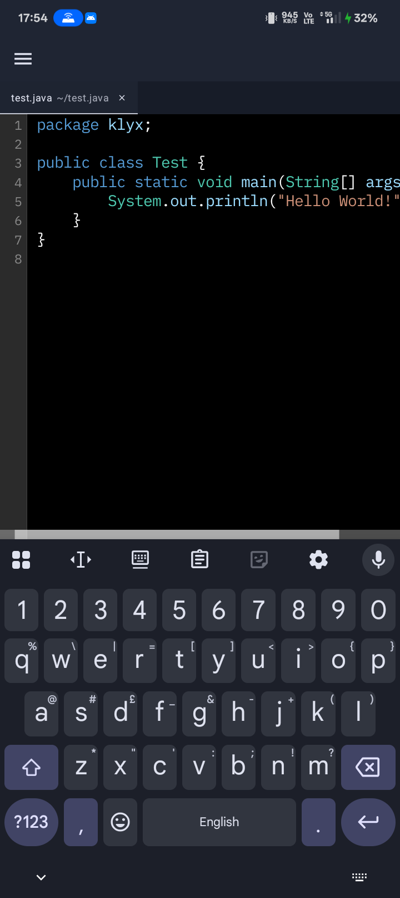

# Klyx

Klyx is a lightweight, high-performance code editor built for Android. It provides a seamless coding experience on mobile devices.

## Features

- Fast and responsive code editing
- Optimized for Android devices
- Clean and intuitive user interface
- Local file management
- Dark/Light theme support
- Syntax highlighting for multiple languages

## Screenshot



## Requirements

- Android 8.0 (API level 26) or higher
- Android Studio Narwhal Feature Drop or later (if building from source)
- Minimum 2GB RAM recommended

## Installation

### For Users

1. Download the latest APK from the [Releases](https://github.com/klyx-dev/klyx/releases) page
2. Install the APK on your Android device
3. Grant necessary permissions when prompted

### For Developers

1. Clone the repository:
   ```bash
   git clone https://github.com/klyx-dev/klyx.git
   cd klyx
   ```

2. Open the project in Android Studio (Narwhal Feature Drop or later)

3. Build and run on an Android device or emulator

## Usage

1. Launch Klyx on your Android device
2. Create a new file or open an existing one
3. Start coding with the built-in editor

## Contributing

We welcome contributions! If you're interested in helping improve Klyx, please check out our [Contributing Guidelines](CONTRIBUTING.md) and [Code of Conduct](CODE_OF_CONDUCT.md).

## License

This project is licensed under the GNU General Public License v3.0 - see the [LICENSE](LICENSE) file for details.

## Support

- Report bugs and request features on [GitHub Issues](https://github.com/klyx-dev/klyx/issues)
- Join our [Discord community](https://discord.gg/z9WWyJjtGy) for discussions and support
