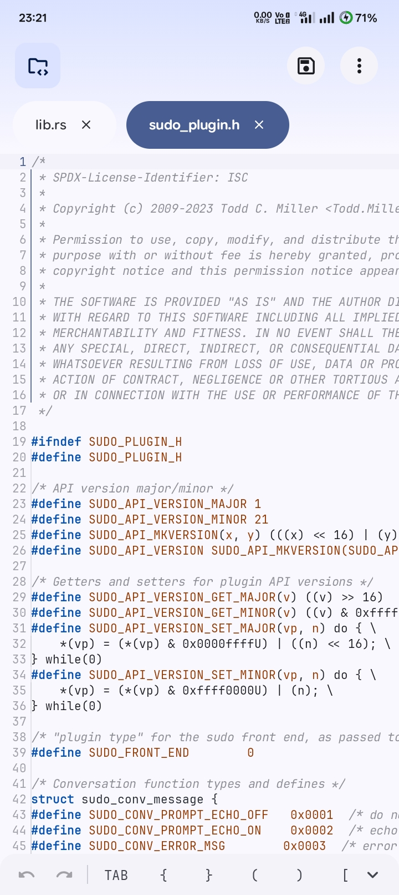
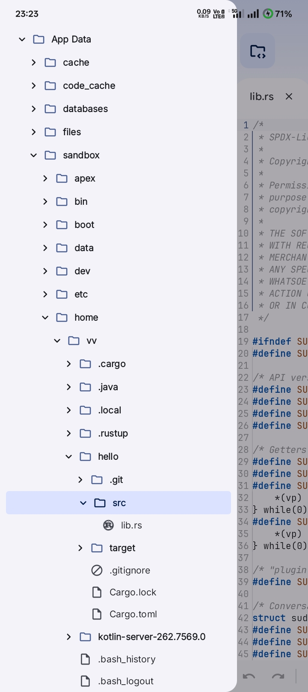
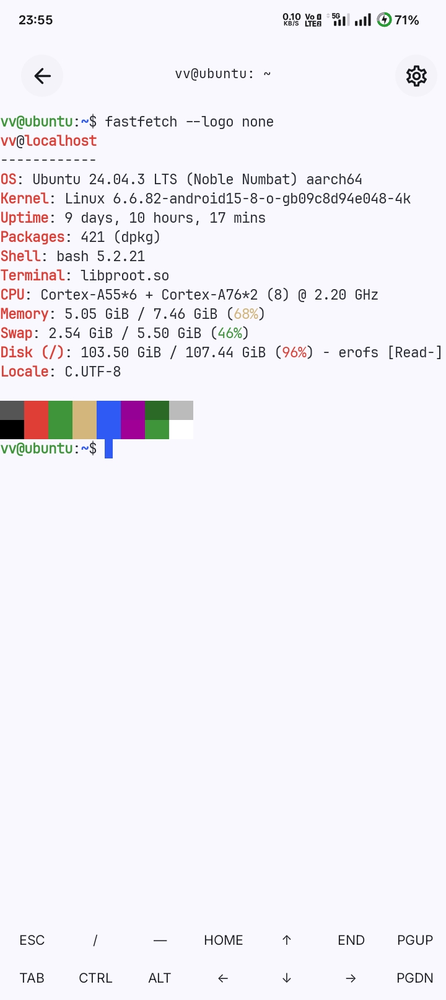

# Klyx

[](https://github.com/klyx-dev/klyx/actions/workflows/ci.yml)
[](LICENSE)
[](https://discord.gg/gTHQTPHNaT)

Klyx is a modern code editor for Android built with Jetpack Compose and Material 3 Expressive.

## Screenshots

<p align="center">
  
  
  
</p>

## Download

Download the latest release from the [Releases](https://github.com/klyx-dev/klyx/releases/latest) page.

## Building

```bash
git clone --recurse-submodules https://github.com/klyx-dev/klyx.git
cd klyx
./gradlew generateGrammarFiles
./gradlew assembleDebug
```

## Requirements

* Android 8.0 (API 26) or later
* Android Studio Meerkat or newer
* Android SDK and NDK

## Status

Klyx is under active development. Features and APIs may change between releases.

## Contributing

Contributions, bug reports, and feature requests are welcome.

* Issues: https://github.com/klyx-dev/klyx/issues
* Discussions: https://github.com/klyx-dev/klyx/discussions

## License

Licensed under the GNU General Public License v3.0 (GPL-3.0). See [LICENSE](LICENSE) for details.
