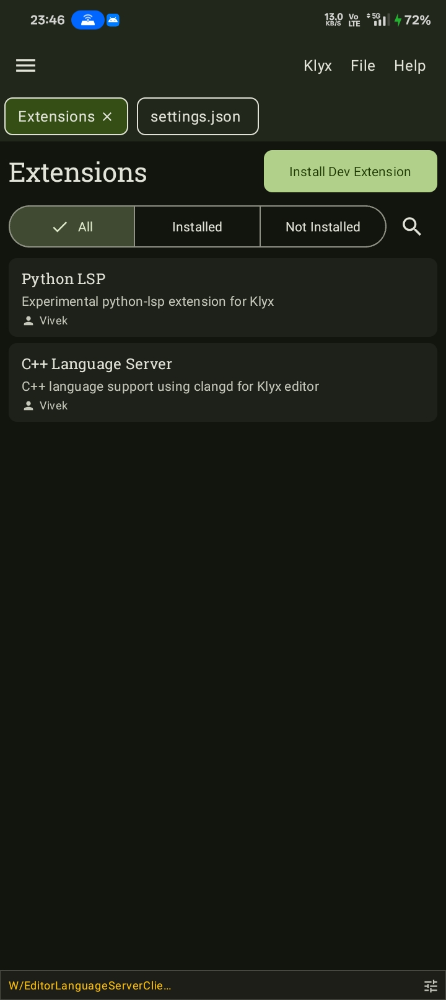
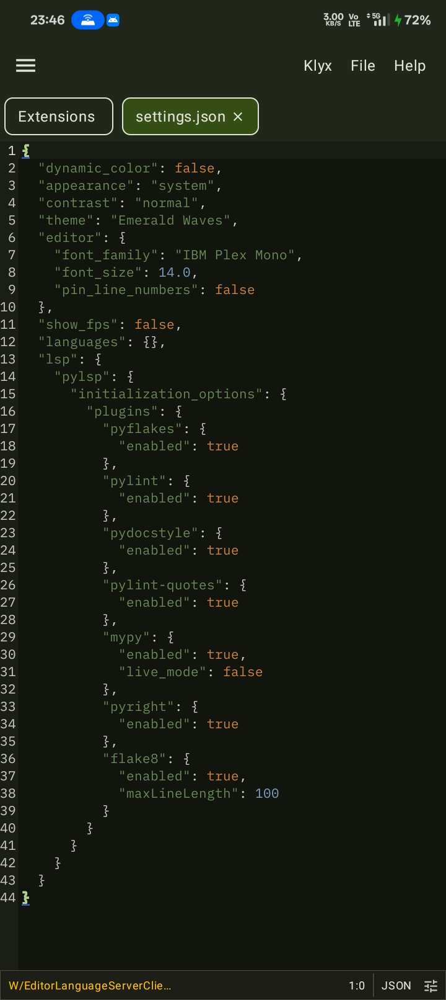
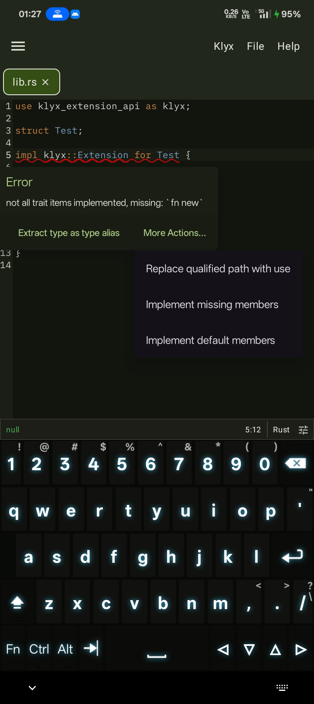
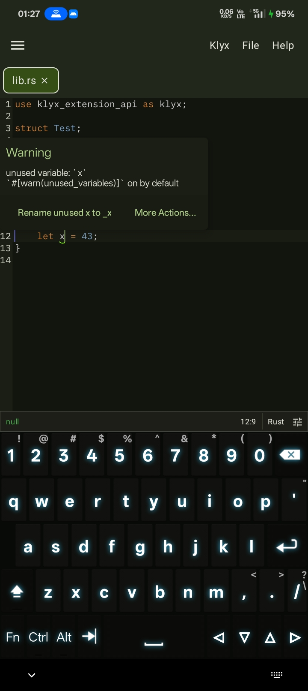

# Klyx

[](https://github.com/klyx-dev/klyx/actions/workflows/ci.yml)
[](https://github.com/klyx-dev/klyx/blob/main/LICENSE)

![badge][badge-android]

Klyx is a lightweight, high-performance code editor built for Android. It provides a seamless coding experience on mobile devices with powerful features similar to desktop code editors like [Zed](https://zed.dev), but optimized specifically for Android.

## Features

- [x] Syntax Highlighting
- [x] Multi-tab Editing
- [x] File Tree Browser
- [x] Multiple Font Support
- [x] Dynamic Color Schemes (Android 12+)
- [x] Theme Selector
- [x] Status Bar
- [x] Project Support
- [x] Multi-root Workspaces
- [x] File Type Detection
- [x] LSP Support
- [x] Command Palette
- [x] Keyboard Shortcuts
- [x] Extension System
- [x] Built-in Terminal
- [x] Custom User Sessions
- [x] Language Server Extensions
- [ ] Find & Replace
- [ ] Undo/Redo
- [ ] Hover Information
- [ ] Go to Definition
- [ ] Document Formatting
- [ ] Git Integration

## Screenshots

<div>
  
  
  
</div>
<div>
  
  
  
</div>
<div>
  
  
  
</div>

## System Requirements

- **Android Version**: Android 8.0 (API level 26) or higher
- **RAM**: Minimum 2GB, recommended 4GB or more
- **Storage**: At least 500MB free space for app and extensions
- **Permissions**: Storage access for file management
- **Network**: Internet connection required for extensions and terminal setup

## Getting Started

1. **Install Klyx** from the releases page
2. **Grant Storage Permission** when prompted
3. **Open a Project** using the file browser
4. **Start Coding**
5. **Access Terminal** for command-line operations
6. **Install Extensions** to add more language support

## Contributing

We welcome contributions! If you're interested in helping improve Klyx, please check out our [Contributing Guidelines](CONTRIBUTING.md) and [Code of Conduct](CODE_OF_CONDUCT.md).

### Development Setup

```bash
git clone --recurse-submodules https://github.com/klyx-dev/klyx.git
cd klyx
./gradlew assembleRelease
```

## License

This project is licensed under the GNU General Public License v3.0 - see the [LICENSE](LICENSE) file for details.

## Support

- Report bugs and request features on [GitHub Issues](https://github.com/klyx-dev/klyx/issues)
- Join our [Discord community](https://discord.gg/z9WWyJjtGy) for discussions and support

## Acknowledgments

- [Sora Editor](https://github.com/Rosemoe/sora-editor) - Core text editing functionality
- [Eclipse LSP4J](https://github.com/eclipse-lsp4j/lsp4j) - Language Server Protocol implementation
- [Termux](https://github.com/termux) - Terminal UI
- [Ubuntu](https://cdimage.ubuntu.com/ubuntu-base/releases/plucky/release/) - Terminal environment base

[badge-android]: http://img.shields.io/badge/-android-6EDB8D.svg?style=flat
[badge-android-native]: http://img.shields.io/badge/support-[AndroidNative]-6EDB8D.svg?style=flat
