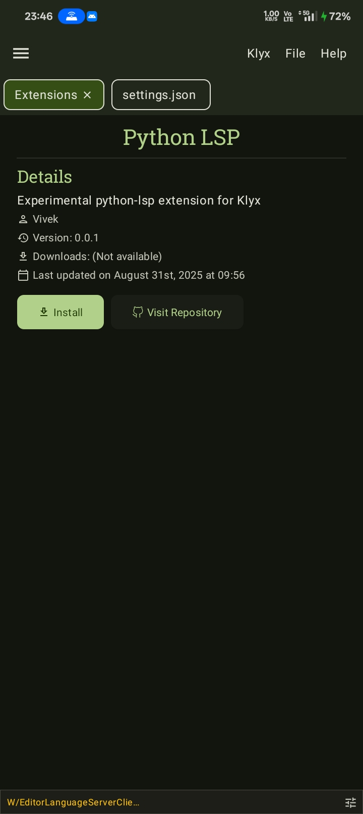
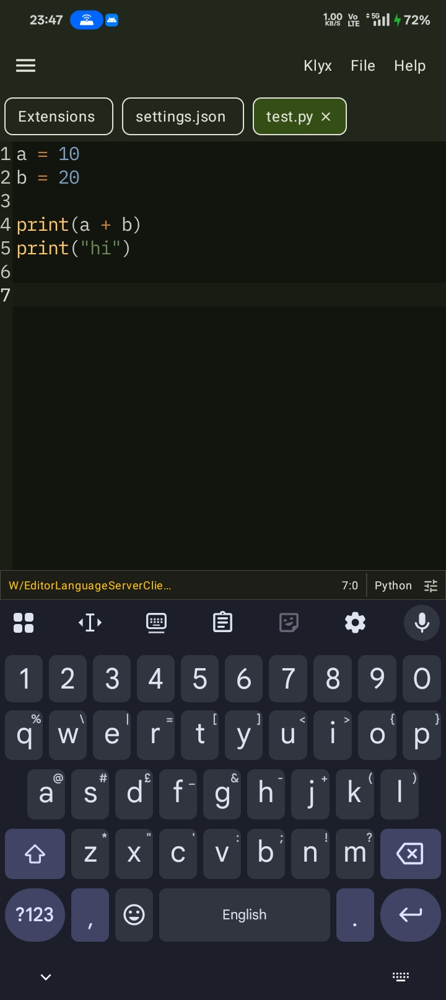
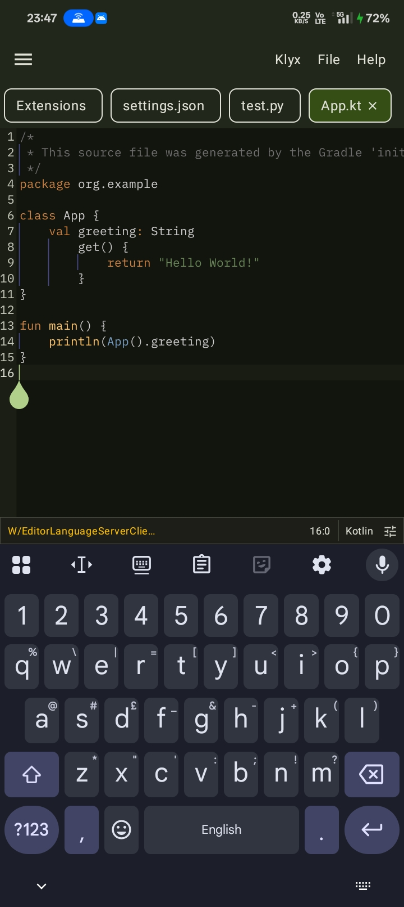
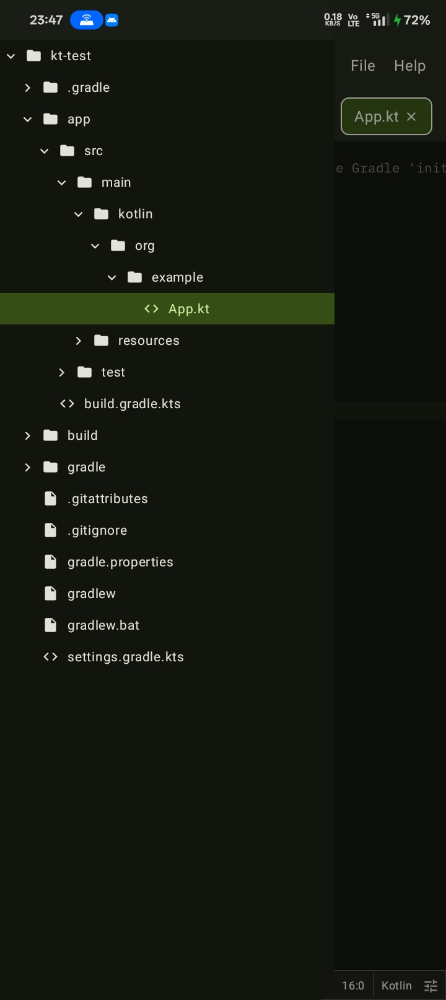

# Klyx

[](https://github.com/klyx-dev/klyx/actions/workflows/ci.yml)
[](https://github.com/klyx-dev/klyx/blob/main/LICENSE)

![badge][badge-android]

Klyx is a lightweight, high-performance code editor built for Android. It provides a seamless coding experience on mobile devices with powerful features similar to desktop code editors like [Zed](https://zed.dev), but optimized specifically for Android.

## Features

- [x] **Syntax Highlighting** - TextMate grammar support with multiple themes
- [x] **Multi-tab Editing** - Open and manage multiple files simultaneously
- [x] **File Tree Browser** - Navigate project structures with expandable file tree
- [x] **Multiple Font Support** - Customizable fonts
- [x] **Dynamic Color Schemes** - Material 3 design with adaptive colors
- [x] **Theme Selector** - Easy theme switching with live preview
- [x] **Status Bar** - Real-time cursor position and language information
- [x] **Project Support** - Open and manage entire project directories
- [x] **Multi-root Workspaces** - Support for multiple project roots
- [x] **File Type Detection** - Automatic language detection based on file extensions
- [x] **File Associations** - Support for 20+ programming languages and file types
- [x] **LSP Support** - Full Language Server Protocol integration (via Extensions)
- [x] **Auto-completion** - LSP-powered intelligent code completion
- [x] **Error Diagnostics** - Real-time syntax and semantic error detection
- [x] **Command Palette** - Quick access to all editor commands (Ctrl+Shift+P)
- [x] **Keyboard Shortcuts** - Extensive keyboard shortcut support
- [x] **Extension System** - Extensible architecture with plugin support
- [x] **Built-in Terminal** - Full Ubuntu-based terminal environment
- [x] **Package Management** - Ubuntu package system support
- [x] **Custom User Sessions** - Create and manage terminal user accounts
- [x] **Extension Manager** - Install and manage extensions
- [x] **Extension Repository** - Browse and install community extensions
- [x] **Language Server Extensions** - Add support for new programming languages
- [ ] **Find & Replace** - Text search and replacement functionality
- [ ] **Undo/Redo** - Complete editing history management
- [ ] **Hover Information** - Context-aware documentation on hover
- [ ] **Go to Definition** - Navigate to symbol definitions
- [ ] **Document Formatting** - Automatic code formatting
- [ ] **Git Integration** - Basic git support for version control

## Screenshots

<div>
  
  
  
</div>
<div>
  
  
  
</div>

## System Requirements

- **Android Version**: Android 8.0 (API level 26) or higher
- **RAM**: Minimum 2GB, recommended 4GB or more
- **Storage**: At least 500MB free space for app and extensions
- **Permissions**: Storage access for file management
- **Network**: Internet connection required for extensions and terminal setup

## Getting Started

1. **Install Klyx** from the releases page
2. **Grant Storage Permission** when prompted
3. **Open a Project** using the file browser
4. **Start Coding**
5. **Access Terminal** for command-line operations
6. **Install Extensions** to add more language support

## Contributing

We welcome contributions! If you're interested in helping improve Klyx, please check out our [Contributing Guidelines](CONTRIBUTING.md) and [Code of Conduct](CODE_OF_CONDUCT.md).

### Development Setup

```bash
git clone --recurse-submodules https://github.com/klyx-dev/klyx.git
cd klyx
./gradlew build
```

## License

This project is licensed under the GNU General Public License v3.0 - see the [LICENSE](LICENSE) file for details.

## Support

- Report bugs and request features on [GitHub Issues](https://github.com/klyx-dev/klyx/issues)
- Join our [Discord community](https://discord.gg/z9WWyJjtGy) for discussions and support

## Acknowledgments

- [Sora Editor](https://github.com/Rosemoe/sora-editor) - Core text editing functionality
- [Eclipse LSP4J](https://github.com/eclipse-lsp4j/lsp4j) - Language Server Protocol implementation
- [Termux](https://github.com/termux) - Terminal UI
- [Ubuntu](https://cdimage.ubuntu.com/ubuntu-base/releases/plucky/release/) - Terminal environment base

[badge-android]: http://img.shields.io/badge/-android-6EDB8D.svg?style=flat
[badge-android-native]: http://img.shields.io/badge/support-[AndroidNative]-6EDB8D.svg?style=flat
